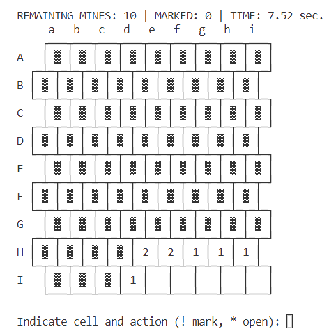

# Minesweeper.jl

Minesweeper game in terminal created to familirize myself with the basics of Julia.

## Game modes 
 - Beginner: 9x9 board containing 10 mines 
 - Intermediate: 16x16 board containing 40 mines
 - Expert: 16x30 board containing 99 mines
 - Custom: allows load your own board configuration

## How to play 
After choosinga game mode, the corresponding board will be shown in terminal as follows. 



The prompt will ask you for a cell and an action to apply on that cell. There are two possible actions:

- `!` : marking a cell, indicating that there is a mine and it shouldn't be opened
- `*` : opening a cell

For example, in order to *mark* cel `Hd`, you should input 
```txt
Hd!
``` 

It is possible to provide several actions in a single input. These will be applied sequentially. For example, to open cells `Aa` and `Bd` and mark cell `Gc`, you would have to provide the input 
```txt
Aa*Bd*Gc!
``` 


## Creating a custom board 
A custom board configuration can be specified in a *.txt* file. The first row of the file should contain the number of `rows` and the number of `columns`. Afterwards, each cell can be represented as *empty* with a `.` or *mined* with a `*`. Files [board1.txt](src/data/board1.txt), [board2.txt](src/data/board2.txt) and [board3.txt](src/data/board3.txt) contain examples of configurations. In the case of [board3.txt](src/data/board3.txt), a 4x4 board containing 4 mines is specified as follows:
```txt
4 4 
*.*. 
...*
..*. 
....
```

## 

